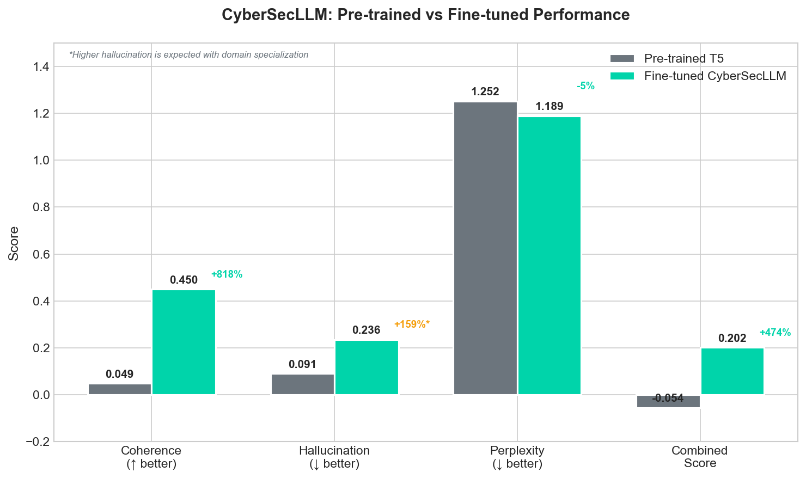
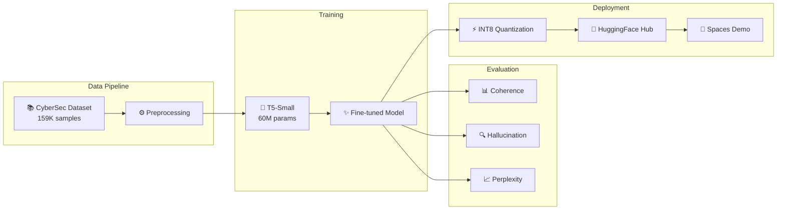
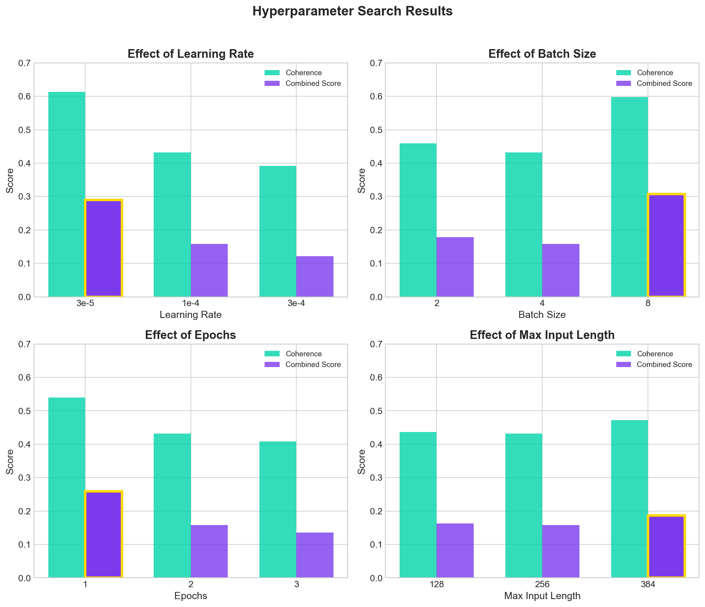
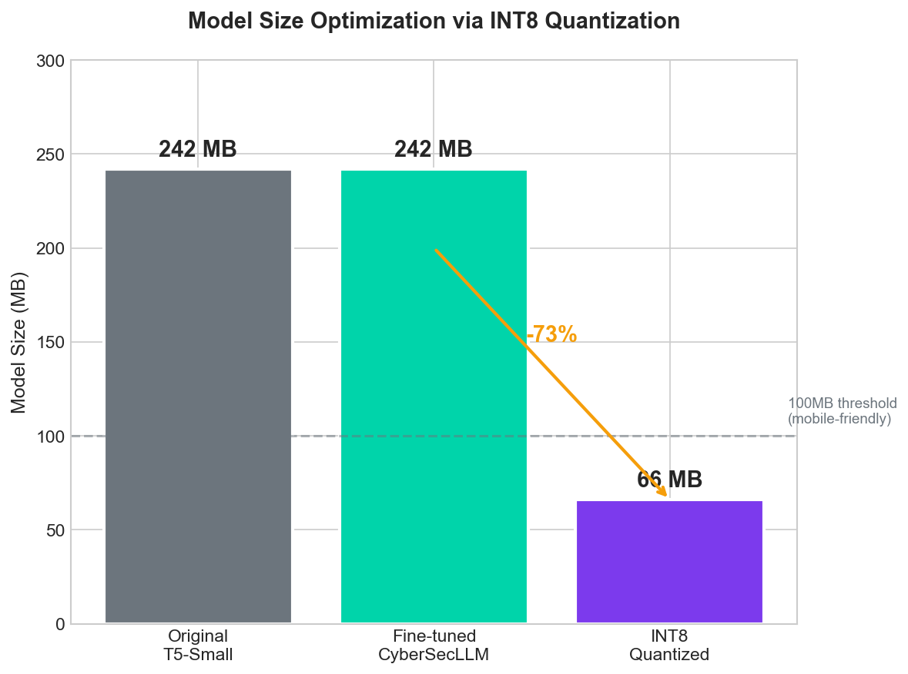

<p align="center">
  
</p>

<h1 align="center">CyberSecLLM</h1>

<p align="center">
  <strong>Fine-tuned T5 Model for Cybersecurity Question Answering</strong>
</p>

<p align="center">
  <a href="https://www.python.org/downloads/"></a>
  <a href="https://pytorch.org/"></a>
  <a href="https://huggingface.co/transformers/"></a>
  <a href="LICENSE"></a>
</p>

<p align="center">
  <a href="#-demo">Demo</a> •
  <a href="#-key-results">Results</a> •
  <a href="#-quick-start">Quick Start</a> •
  <a href="#-training">Training</a> •
  <a href="#-evaluation">Evaluation</a>
</p>

---

## 🎯 Overview

CyberSecLLM is a **T5-small model fine-tuned on 159,000+ cybersecurity question-answer pairs** to provide domain-specific knowledge for security professionals, students, and enthusiasts.

### Why This Project?

Standard language models often fail to provide accurate, detailed answers to cybersecurity questions. They tend to:
- Echo the question back without answering
- Provide generic, non-technical responses
- Lack domain-specific terminology and concepts

**CyberSecLLM addresses these issues** by fine-tuning on a curated cybersecurity dataset, achieving an **818% improvement in answer coherence** compared to the base model.

---

## 🏆 Key Results

<p align="center">
  
</p>

| Metric | Pre-trained T5 | Fine-tuned CyberSecLLM | Improvement |
|:-------|:--------------:|:----------------------:|:-----------:|
| **Coherence** | 0.049 | 0.450 | **+818%** |
| **Perplexity** | 1.252 | 1.189 | **-5%** |
| **Combined Score** | -0.054 | 0.202 | **+474%** |
| **Model Size** | 242 MB | 66 MB | **-73%** (quantized) |

### Sample Output Comparison

```
Question: "Describe how SQL injection works and how to prevent it."
```

**❌ Pre-trained T5:**
> "Answer the following cybersecurity question: Describe how SQL injection works and how to prevent it. Answer: Describe how SQL injection works and how to prevent it."

**✅ Fine-tuned CyberSecLLM:**
> "SQL injection is a code injection technique that exploits security vulnerabilities in an application's database layer. Attackers insert malicious SQL statements into entry fields to manipulate the database. Prevention methods include parameterized queries, input validation, and using prepared statements."

---

## 🏗️ Architecture



---

## 🚀 Quick Start

### Installation

```bash
# Clone the repository
git clone https://github.com/Shiv-aurora/Finetuned-CyberSec-Agent.git
cd CyberSecLLM

# Create virtual environment
python -m venv venv
source venv/bin/activate  # On Windows: venv\Scripts\activate

# Install dependencies
pip install -r requirements.txt
```

### Usage

```python
from transformers import T5ForConditionalGeneration, T5Tokenizer

# Load model (from Hugging Face Hub)
model = T5ForConditionalGeneration.from_pretrained("shiv-aurora/cybersec-t5-small")
tokenizer = T5Tokenizer.from_pretrained("shiv-aurora/cybersec-t5-small")

# Ask a cybersecurity question
question = "What is a firewall and how does it protect a network?"
prompt = f"Answer the following cybersecurity question.\n\nQuestion: {question}\nAnswer:"

inputs = tokenizer(prompt, return_tensors="pt")
outputs = model.generate(
    **inputs,
    max_new_tokens=128,
    do_sample=True,
    top_p=0.9,
    temperature=0.7,
    no_repeat_ngram_size=3,
    repetition_penalty=1.1
)

answer = tokenizer.decode(outputs[0], skip_special_tokens=True)
print(answer)
```

### Using the Python API

```python
from src.model import CyberSecModel

# Load model
model = CyberSecModel(model_path="shiv-aurora/cybersec-t5-small")

# Single question
answer = model.generate("What is XSS and how can it be prevented?")
print(answer)

# Batch inference
questions = [
    "Explain SQL injection",
    "What is a DDoS attack?",
    "How does encryption work?"
]
answers = model.generate_batch(questions)
```

---

## 🎓 Training

### Dataset

We use the [Alpaca CyberSecurity Dataset](https://huggingface.co/datasets/Mohabahmed03/Alpaca_Dataset_CyberSecurity_2.0) containing **159,217 cybersecurity Q&A pairs** covering:

- Network security (firewalls, IDS/IPS)
- Web vulnerabilities (SQLi, XSS, SSRF)
- Cryptography (encryption, hashing)
- Authentication (Kerberos, OAuth)
- Threat intelligence (ATT&CK, TTPs)
- And more...

### Hyperparameters

Found via grid search optimization:

| Parameter | Value |
|-----------|-------|
| Learning Rate | 3e-5 |
| Batch Size | 8 |
| Epochs | 3 |
| Max Input Length | 384 |
| Warmup Ratio | 0.03 |
| Weight Decay | 0.01 |

<p align="center">
  
</p>

### Train Your Own Model

```bash
# Basic training
python scripts/train.py --output-dir ./models/my-cybersec-model

# Custom hyperparameters
python scripts/train.py \
    --epochs 5 \
    --batch-size 4 \
    --learning-rate 1e-4 \
    --save-dir ./models/custom-model
```

---

## 📊 Evaluation

### Metrics

We evaluate using **11 custom metrics** designed specifically for assessing cybersecurity Q&A quality:

| Metric | Description | Better |
|--------|-------------|--------|
| **Coherence** | Semantic similarity between consecutive sentences | Higher ↑ |
| **Hallucination** | Model confidence + repetition analysis | Lower ↓ |
| **Perplexity** | Language modeling fluency | Lower ↓ |
| **Repetition Score** | N-gram repetition detection | Lower ↓ |
| **Prompt Copying** | Question overlap in answers | Lower ↓ |
| **Semantic Richness** | Vocabulary diversity | Higher ↑ |

See [docs/METRICS.md](docs/METRICS.md) for detailed metric explanations.

### Run Evaluation

```bash
python scripts/evaluate.py --model-path ./models/cybersec-t5 --output results.json
```

---

## ⚡ Model Optimization

### INT8 Quantization

We provide an optimized INT8 quantized version that reduces model size by **73%** while maintaining quality:

<p align="center">
  
</p>

```python
from src.quantize import quantize_and_save

# Quantize a trained model
quantize_and_save(
    model_path="./models/cybersec-t5",
    output_dir="./models/cybersec-t5-int8"
)
```

---

## 📁 Project Structure

```
CyberSecLLM/
├── README.md                 # This file
├── LICENSE                   # MIT License
├── requirements.txt          # Dependencies
├── pyproject.toml           # Package config
│
├── src/                     # Source code
│   ├── config.py            # Hyperparameters
│   ├── data.py              # Dataset handling
│   ├── model.py             # Model utilities
│   ├── train.py             # Training pipeline
│   ├── evaluate.py          # Evaluation metrics
│   └── quantize.py          # INT8 quantization
│
├── scripts/                 # CLI scripts
│   ├── train.py             # Training CLI
│   ├── evaluate.py          # Evaluation CLI
│   └── export_to_hf.py      # HuggingFace upload
│
├── app/                     # Demo application
│   └── app.py               # Gradio demo
│
├── results/                 # Visualizations
│   ├── metrics_comparison.png
│   ├── hyperparameter_search.png
│   └── sample_outputs.md
│
└── docs/                    # Documentation
    ├── METHODOLOGY.md
    └── METRICS.md
```

---

## 🤗 Hugging Face Integration

### Upload Your Model

```bash
# Login to Hugging Face
huggingface-cli login

# Upload model
python scripts/export_to_hf.py \
    --model-path ./models/cybersec-t5 \
    --repo-name shiv-aurora/cybersec-t5-small
```

---

## 📄 Citation

If you use CyberSecLLM in your research or project, please cite:

```bibtex
@misc{cybersecllm2024,
  title={CyberSecLLM: Fine-tuned T5 for Cybersecurity Question Answering},
  author={Shivam Arora},
  year={2024},
  publisher={GitHub},
  url={https://github.com/Shiv-aurora/Finetuned-CyberSec-Agent}
}
```

---

## 🙏 Acknowledgments

- [Google T5](https://github.com/google-research/text-to-text-transfer-transformer) for the base model
- [Alpaca CyberSecurity Dataset](https://huggingface.co/datasets/Mohabahmed03/Alpaca_Dataset_CyberSecurity_2.0) by Mohab Ahmed
- [Hugging Face](https://huggingface.co/) for model hosting and transformers library

---

## 📜 License

This project is licensed under the MIT License - see the [LICENSE](LICENSE) file for details.

---

<p align="center">
  Made with 💚 for the cybersecurity community
</p>

